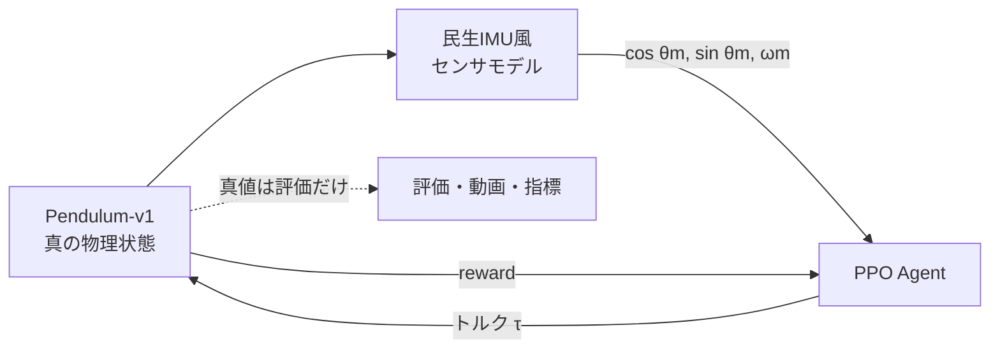

# rl-pendulum-ppo

[](https://github.com/temesotejam/rl-pendulum-ppo/actions/workflows/ci.yml)

**物理シミュレーション上の振り子を、強化学習 PPO が少しずつ上手に制御できるようになる過程を見るための実験リポジトリです。**

このリポジトリでは、最初から正解の制御則を与えません。PPO エージェントは、シミュレータから得られるセンサ観測と報酬を使い、何度も試行しながら「どの状態で、どちら向きに、どれだけトルクを出すか」を学習します。

さらに、理想的な角度・角速度をそのまま AI に渡すのではなく、**民生用 MEMS IMU を想定した観測ノイズとバイアス**を加えています。シミュレーション内部の真値は評価専用で、PPO は見ることができません。

GitHub Actions の CPU runner 上だけで学習・評価・動画生成まで完結し、結果を Artifact としてダウンロードできます。

このリポジトリは、今後 `rl-<environment>-<algorithm>` という命名で物理環境と学習方法を1つずつ分けて試していくシリーズの第1号です。

---

## まず何が見られるのか

1回学習すると、同一の評価条件に対して次の5段階を比較できます。

1. `random` — 学習前。ランダムなトルク
2. `25_percent` — 全学習量のおよそ25%
3. `50_percent` — およそ50%
4. `75_percent` — およそ75%
5. `100_percent` — 学習終了時

各段階で同じ評価 seed と同じセンサノイズ生成条件を使うため、単に「初期姿勢が簡単だった」だけなのか、本当に方策が改善したのかを比較しやすくしています。

生成される成果物は次の通りです。

```text
results/
├── videos/
│   ├── 00_random.mp4
│   ├── 01_25_percent.mp4
│   ├── 02_50_percent.mp4
│   ├── 03_75_percent.mp4
│   └── 04_100_percent.mp4
│
├── models/
│   ├── 25_percent.zip
│   ├── 50_percent.zip
│   ├── 75_percent.zip
│   └── 100_percent.zip
│
├── plots/
│   ├── learning_curve.png
│   ├── angle_error.png
│   └── upright_ratio.png
│
├── metrics.csv
├── metadata.json
└── summary.md
```

最初は `00_random.mp4` と `04_100_percent.mp4` を見比べ、そのあと `learning_curve.png` と `angle_error.png` を見るのがおすすめです。

---

# システム全体



重要なのは、**PPO が受け取る値と、評価に使う真値を分離していること**です。

```text
物理シミュレータの真値
        │
        ├────────────→ 評価・動画
        │                ↑
        ↓                │ PPOには見せない
センサノイズ付加         │
        ↓                │
PPOへの観測値 ───────────┘
```

---

# 物理環境: Gymnasium `Pendulum-v1`

[Gymnasium Pendulum-v1](https://gymnasium.farama.org/environments/classic_control/pendulum/) を使用します。

回転軸に直接トルクを与えられる1自由度の振り子です。

```text
          ● mass
         /
        /
       O  pivot
       ↺ τ
```

目標は、振り子を上向きに近づけ、できるだけ静かに保つことです。

## 真の状態

シミュレータ内部には主に次の状態があります。

```text
θ       振り子角度
θdot    角速度
```

ただし PPO にこの真値を直接渡しません。

---

# センサモデル

## なぜノイズを入れるのか

理想シミュレーションで、

```text
真の θ
真の θdot
```

をそのまま制御器へ渡すと、現実よりかなり有利な条件になります。

実際の MEMS IMU には、

- 瞬間的な測定ノイズ
- ゼロ点のずれ
- 姿勢推定誤差
- 温度や個体差によるバイアス

があります。

そこで本実験では、最初の段階として **白色ノイズ + エピソードごとの固定バイアス** を模擬します。

## 観測モデル

角度は、

```text
θ_measured = θ_true + bθ + nθ
```

角速度は、

```text
ω_measured = ω_true + bω + nω
```

とします。

ここで、

```text
bθ  : 1エピソード中は一定の角度バイアス
nθ  : 毎サンプル変化する角度ノイズ
bω  : 1エピソード中は一定のジャイロバイアス
nω  : 毎サンプル変化するジャイロノイズ
```

です。

PPO に実際に渡す観測は、

```text
[ cos(θ_measured), sin(θ_measured), ω_measured ]
```

です。

## デフォルトの「民生用IMU」設定

```yaml
sensor_noise:
  enabled: true
  angle_noise_std_deg: 0.25
  angle_bias_std_deg: 1.0
  gyro_noise_std_dps: 0.10
  gyro_bias_std_dps: 0.30
```

| 項目 | 標準偏差 | 意味 |
|---|---:|---|
| 角度白色ノイズ | 0.25° | 毎サンプルの細かな揺らぎ |
| 角度バイアス | 1.0° | エピソードごとの姿勢ゼロ点ずれ |
| ジャイロ白色ノイズ | 0.10°/s | 毎サンプルの角速度ノイズ |
| ジャイロバイアス | 0.30°/s | エピソードごとの角速度ゼロ点ずれ |

これらは特定の1機種を完全再現した値ではなく、**一般的な民生 MEMS IMU を想定した、少し保守的な最初の実験条件**です。

設定値を考える参考として、例えば次の実在センサがあります。

- CEVA BNO08X: fused rotation vector の static non-heading error は約 1.5°、dynamic non-heading error は約 2.5°（Gaming Rotation Vector）
- Bosch BMI270: 100 Hz Normal Mode のジャイロ RMS noise は代表値約 62 mdps
- TDK InvenSense ICM-42688-P: ジャイロ noise density 2.8 mdps/√Hz

参考資料:

- [CEVA BNO08X Datasheet](https://www.ceva-ip.com/wp-content/uploads/BNO080_085-Datasheet.pdf)
- [Bosch BMI270 Datasheet](https://www.bosch-sensortec.com/media/boschsensortec/downloads/datasheets/bst-bmi270-ds000.pdf)
- [TDK InvenSense ICM-42688-P Datasheet](https://invensense.tdk.com/wp-content/uploads/2021/06/DS-000347-ICM-42688-P-v1.5.pdf)

将来はここへ、

- バイアスのゆっくりしたドリフト
- サンプリング周期のばらつき
- センサ遅延
- ローパスフィルタ
- 量子化
- 外乱加速度による姿勢推定誤差

などを追加できます。

---

# PPO が見る観測値

エージェントの入力は3値です。

```text
[ cos(θm), sin(θm), ωm ]
```

| 値 | 意味 |
|---|---|
| `cos(θm)` | ノイズを含んだ推定角度の cos |
| `sin(θm)` | ノイズを含んだ推定角度の sin |
| `ωm` | ノイズを含んだ角速度 |

角度そのものではなく `sin` と `cos` を使うことで、`+π` と `-π` の境界で値が突然飛ぶ問題を避けています。

---

# PPO の行動

AI が出力する行動は1つです。

```text
τ = pivot torque
```

`Pendulum-v1` の行動範囲は、

```text
-2 <= τ <= +2
```

です。

つまり PPO は毎 step、

> 今のセンサ値なら、左向き/右向きにどれくらいトルクを出すか

だけを決めています。

---

# 報酬

Pendulum-v1 の基本的なコストは、概ね次の形です。

```text
cost = θ² + 0.1 θdot² + 0.001 τ²
reward = -cost
```

そのためエージェントは、

1. 上向き `θ = 0` に近づく
2. 上向き付近で角速度を小さくする
3. 不必要に大きなトルクを使わない

方向へ学習します。

reward は基本的に0以下なので、**episode return は0に近いほど良い**と読めます。

ここで reward 自体は物理シミュレータの真の状態から計算されます。これは「教師が真の状態を知っている」ことに相当しますが、PPO の方策入力には真値を入れていません。

---

# 学習方法: PPO

[Stable-Baselines3](https://stable-baselines3.readthedocs.io/) の PPO（Proximal Policy Optimization）を使います。

PPO は現在の方策で経験を集め、その経験からニューラルネットを更新します。一度の更新で方策が極端に変わりすぎないよう抑えながら改善していく手法です。

設定は [RL Baselines3 Zoo](https://github.com/DLR-RM/rl-baselines3-zoo/blob/master/hyperparams/ppo.yml) の Pendulum-v1 向け設定を基準にしています。

```yaml
n_envs: 4
n_steps: 1024
batch_size: 64
n_epochs: 10
gamma: 0.9
gae_lambda: 0.95
learning_rate: 0.001
clip_range: 0.2
use_sde: true
sde_sample_freq: 4
```

4つの Pendulum 環境から並列に経験を集めます。

```text
Noisy Pendulum #1 ─┐
Noisy Pendulum #2 ─┤
Noisy Pendulum #3 ─┼──> PPO update
Noisy Pendulum #4 ─┘
```

`use_sde: true` により、連続制御向けの State Dependent Exploration も利用します。

---

# GitHub Actions で学習する

## 1. Actions を開く

```text
repository
    ↓
Actions
    ↓
Train RL Agent
    ↓
Run workflow
```

## 2. preset を選ぶ

| preset | 学習 step | 評価 episode | 用途 |
|---|---:|---:|---|
| `quick` | 20,000 | 3 | 配線確認に相当する短い動作確認 |
| `normal` | 100,000 | 10 | 最初におすすめ |
| `long` | 500,000 | 20 | より長く学習 |

初回は **`normal`** を推奨します。

## 3. seed

初回は `42` のままで構いません。

別 seed でも同程度に学習できるかを見ると、1回だけ偶然成功したのかどうかを確認できます。

---

# 結果の読み方

## 1. 動画

```text
00_random.mp4
01_25_percent.mp4
02_50_percent.mp4
03_75_percent.mp4
04_100_percent.mp4
```

同じ評価 seed で比較します。

**動画に描画される振り子は真の物理状態です。PPO が内部で見ている値にはセンサノイズが入っています。**

そのため動画が安定して見えるなら、ノイズのある観測からでも制御できていることになります。

## 2. Mean episode return

`learning_curve.png` に出します。

Pendulum-v1 では0に近いほど良いので、例えば、

```text
-1200
  ↓
-700
  ↓
-300
  ↓
-150
```

のようになれば改善です。

実際の値は seed と学習状態によって変わります。

## 3. RMS angle error

```text
RMS angle error [deg]
```

振り子の**真の角度**が上向き `0°` からどれくらい離れていたかを評価します。

小さいほど良いです。

## 4. Upright ratio

真の角度について、

```text
|θ_true| <= 10°
```

だった時間の割合です。

大きいほど、上向き付近を維持できています。

## 5. RMS angular velocity

真の角速度で評価します。

上向きを高速で通過しただけなのか、実際に落ち着いているのかを見るために使います。

## 6. RMS torque

使用したトルクの大きさです。

これは必ずしも小さいほどよいとは限りません。振り子を振り上げるために大きな入力が必要な場合があるため、角度・報酬と一緒に見ます。

---

# 学習前後を公平に比較する仕組み

評価では、各チェックポイントに同じ seed 群を使います。

```text
random       ─┐
25_percent   ─┤
50_percent   ─┼── 同じ physics seed + sensor noise seed
75_percent   ─┤
100_percent  ─┘
```

また、センサの episode bias も seed から再現されます。

したがって、同じ seed なら、

- 同じ初期物理状態
- 同じ角度バイアス
- 同じジャイロバイアス
- 同じノイズ乱数系列

で比較できます。

---

# clean sensor と比較する

保存済みモデルは、コマンドラインから理想センサ条件でも評価できます。

通常のノイズあり評価:

```bash
python -m src.evaluate results/models/100_percent.zip --preset normal --episodes 10
```

ノイズなし評価:

```bash
python -m src.evaluate results/models/100_percent.zip --preset normal --episodes 10 --clean-sensors
```

これにより、

> センサノイズのせいでどの程度性能が落ちているか

も調べられます。

---

# Artifact

学習終了後、workflow run の `Artifacts` から結果をダウンロードできます。

```text
pendulum-ppo-normal-seed-42-run-...
```

中には、

- 学習済みモデル
- 5段階の動画
- グラフ
- `metrics.csv`
- 実験条件 `metadata.json`
- 要約 `summary.md`

が入っています。

通常学習の Artifact は30日、CIの簡易結果は14日保持する設定です。重要な結果はローカルなどへ保存してください。

---

# ローカルPCでも動かす

Python 3.11 を推奨します。

```bash
python -m venv .venv
source .venv/bin/activate
python -m pip install -r requirements.txt
python -m src.train --preset quick --seed 42 --output-dir results
```

Windows PowerShell の場合は virtual environment の有効化方法が異なります。

---

# CI

Pull Request と `main` への push では `.github/workflows/ci.yml` が動きます。

CIでは、

1. Python 環境構築
2. CPU版 PyTorch の導入
3. unit/smoke test
4. `quick` preset の短い end-to-end 学習
5. モデル・動画・グラフが実際に生成されたことの確認
6. Artifact 保存

まで行います。

単に import できるだけではなく、**短い学習を本当に最後まで通す**ことをCIで確認します。

---

# ファイル構成

```text
rl-pendulum-ppo/
├── .github/
│   └── workflows/
│       ├── ci.yml
│       └── train.yml
│
├── configs/
│   ├── quick.yaml
│   ├── normal.yaml
│   └── long.yaml
│
├── src/
│   ├── __init__.py
│   ├── environment.py
│   ├── evaluation.py
│   ├── evaluate.py
│   ├── reporting.py
│   └── train.py
│
├── tests/
│   └── test_smoke.py
│
├── requirements.txt
├── LICENSE
└── README.md
```

---

# 現段階でモデル化していないもの

この第1号は、強化学習の流れを理解し、GitHub Actions 上で再現可能に回すことを優先しています。

まだ次の要素は入れていません。

- アクチュエータ遅れ
- モータ電流立ち上がり
- トルク定数のばらつき
- 摩擦係数のばらつき
- センサ通信遅延
- センサ更新周期の非同期性
- IMU fusion filter の内部状態
- 外乱
- パラメータ同定誤差
- domain randomization

これらは今後、1つずつ加える方が「何が学習に効いたか」を理解しやすくなります。

---

# 次に試したい発展

第1号が安定して動いたら、次の順番が分かりやすいです。

## A. ノイズ強度を変える

```text
ideal sensor
↓
low noise
↓
consumer IMU
↓
high noise
```

として性能低下を見る。

## B. 学習時だけノイズをランダム化する

毎 episode でノイズやバイアス強度そのものを変え、未知のセンサ誤差への頑健性を見る。

## C. 物理パラメータもランダム化する

```text
mass
length
friction
motor strength
```

を少しずつ変える domain randomization を行う。

## D. アルゴリズムを変える

同じ物理環境を別リポジトリで比較する。

```text
rl-pendulum-ppo
rl-pendulum-sac
rl-pendulum-td3
```

同じ評価法にそろえることで、アルゴリズムの差を比較しやすくできます。

## E. 独自の物理環境へ進む

最終的には Gymnasium の既製 Pendulum ではなく、自分で運動方程式を書いた環境へ置き換えられます。

例えば、

```text
rl-reaction-wheel-ppo
```

では、

```text
body angle
body angular velocity
wheel speed
      ↓
     PPO
      ↓
motor torque
```

のようなリアクションホイール系へ発展できます。

---

# このリポジトリの目的

最高性能の倒立振子制御器を作ることだけが目的ではありません。

一番の目的は、

```text
物理環境を定義する
      ↓
観測・センサを定義する
      ↓
行動を定義する
      ↓
報酬を定義する
      ↓
AIに学習させる
      ↓
途中経過を保存する
      ↓
動画と数値で改善を確認する
```

という**強化学習実験の一連の流れを、誰でも再実行できる形で作ること**です。

そのため、設定・乱数 seed・ライブラリバージョン・評価結果を可能な限り Artifact に残します。

---

## License

MIT License
